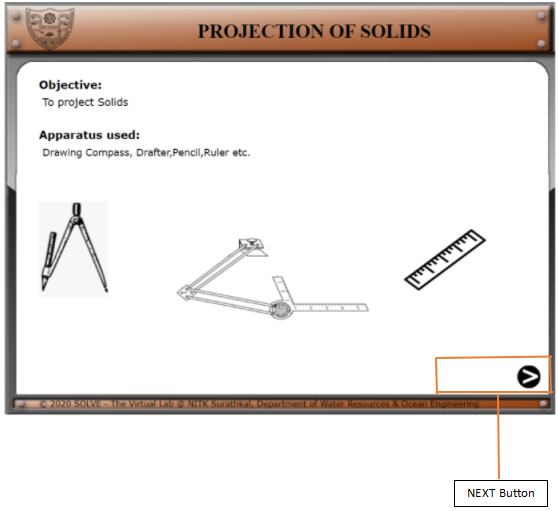
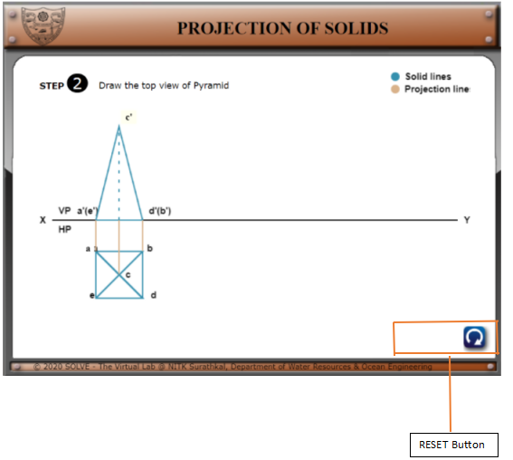

**PROCEDURE**

1).  Click on **“Projection of Lines”** the following window will open, with top view already drawn.
Click on **the NEXT** button to proceed.

****  

2). Clicking on 'a', will continue the simulation to the next step, displaying the front view.  

3). Similarly, by clicking c' the inclined view will appear, in this case it is zero degrees to HP and 45 degrees to VP. The inclined view on a grid sheet is obtained using drawing tools like a compass, a divider and a protractor.  
In the right-hand corner, a Reset button** 
**gets active here.**

4). Finally, after following all the steps, we reach the final
projection.

5). In between any step , if the Reset button
 gets clicked, the whole board resets to the first step.

